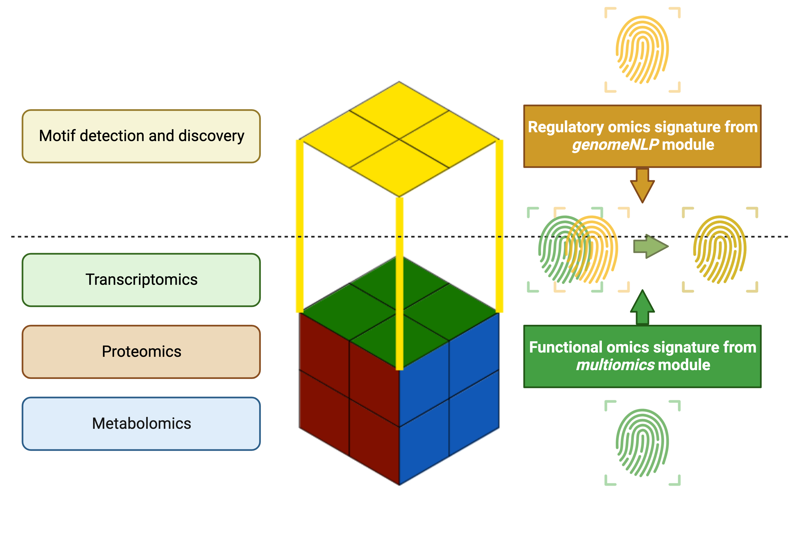
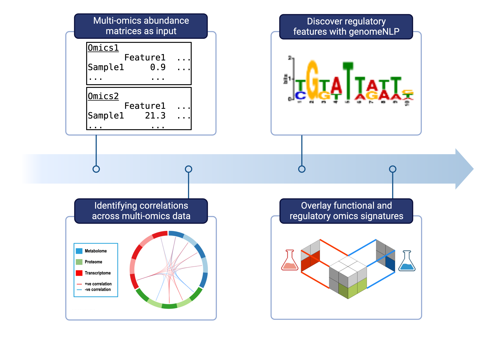

> **NOTE**: The [main repository is on github](https://github.com/tyronechen/sepsis_integration). It is [also mirrored on gitlab](https://gitlab.com/tyagilab/sepsis_integration) but please submit any issues to the main github repository only.

Copyright (c) 2020 <a href="https://orcid.org/0000-0002-9207-0385">Tyrone Chen </a>, <a href="https://orcid.org/0000-0002-2296-2126">Anton Y. Peleg </a>, and <a href="https://orcid.org/0000-0003-0181-6258">Sonika Tyagi </a>

Code in this repository is provided under a [MIT license](https://opensource.org/licenses/MIT). This documentation is provided under a [CC-BY-3.0 AU license](https://creativecommons.org/licenses/by/3.0/au/).

[Visit our lab website here.](https://bioinformaticslab.erc.monash.edu/) Contact Sonika Tyagi at [sonika.tyagi@rmit.edu.au](sonika.tyagi@rmit.edu.au).

# Sepsis integration

We perform an integrated functional and regulatory omics analysis for five Staphylococcus aureus strains. More information regarding data generation is available in our previous manuscript.

- Mu, A., Klare, W.P., Baines, S.L. *et al*. Integrative omics identifies conserved and pathogen-specific responses of sepsis-causing bacteria. *Nat Commun* **14**, 1530 (2023). [https://doi.org/10.1038/s41467-023-37200-w](https://doi.org/10.1038/s41467-023-37200-w)

# Highlights

- Annotation-free: molecule and gene identity are not required
- Generic input: only abundance matrices and raw sequence data are required
- Modular workflow: functional omics and regulatory omics signature are independent but can be merged

## Identifying molecular-level correlations using functional-omics data integration

> **NOTE**: [We apply our previously developed pipeline to the data. Please refer to the corresponding documentation for install instructions and citations](https://github.com/tyronechen/SARS-CoV-2).

We perform a multi-omics data integration at the resolution of individual molecules.

1. Obtain quantitative transcriptomics, proteomics and metabolomics data with same sample identities per omics
2. Preprocess all data into abundance matrices where rows correspond to samples and columns correspond to features
3. Run a vertical integration using sparse partial least squares discriminant analysis, where the discriminating condition is growth media (RPMI vs human sera)
4. This returns a subset of strongly correlated molecules across different omics data

## Regulatory-omics feature detection using natural language processing

> **NOTE**: [We apply our previously developed pipeline to the data. Please refer to the corresponding documentation for install instructions and citations](https://github.com/tyronechen/genomenlp).

We conduct a *de novo* variable-length motif discovery.

1. From the identified molecules, take transcripts of interest
2. Extract promoter regions [-60:+20 TSS] and exonic [+21:101 TSS] regions
3. Using Natural Language Processing and deep learning, identify features of interest by intercepting classification weights
4. Perform an automated and manual annotation workflow for motif detection

## Overlaid functional and regulatory omics layers

Finally, we examine all the results as a whole.
